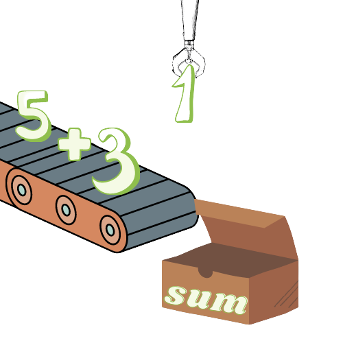

#Algorithms-and-data-structures

    

<h1 align ="center">Algorithms and data structures</h1>

A project to help prepare for the technical interview.

<h2 align="center">Table of Contents</h2>

* [Instructions](https://github.com/Stack-Overfloweth/Algorithms-and-Data-Structures/#Instructions)
* [Contributors](https://github.com/Stack-Overfloweth/Algorithms-and-Data-Structures/#Contributors)
* [License](https://github.com/Stack-Overfloweth/Algorithms-and-Data-Structures/#License)

<h2 href="#Instructions" >Instructions</h2>

  This is a repository to help with algorithms and data structures.  This repository is intended for group work and pair programming.  There will be algorithms sorted in folders based on their data type or data structure.  The is a test suite that you can run with:
    
npm test testfilename

example: npm test arrays
    
If a test isn't running for an algorithm then you probably need to remove the x in front of the describe.
    
We will eventually post links and pictures on how to solve particular algorithms in the associated READMEs in each folder.  
    
If you wish to work alone then I suggest forking and cloning this repo.  Note that we will constantly update this repo so check back if you need to update later.

<h2 href="#Contributors" >Contributors</h2>

<table align="center">
  <tr>
    <td valign="top"> </td>
    <td valign="top"> </td>
    <td valign="top"> </td>
    <td valign="top"> </td>
    <td valign="top"> </td>
  </tr>
  <tr>
      <td valign="top"><h2 align="center">Eric Saldivar</h2></td>
      <td valign="top"><h2 align="center">Charles Malave</h2></td>
      <td valign="top"><h2 align="center">Cameron Walls</h2></td>
      <td valign="top"><h2 align="center">Ian Judd</h2></td>
      <td valign="top"><h2 align="center">Miklos Kertesz</h2></td>
  </tr>
   <tr>
      <td align="center"></td>
      <td align="center"></td>
      <td align="center"></td>
      <td align="center"></td>
       <td align="center"></td>
  </tr>
</table>
<h2 href="#License" >License</h2>

This product is licensed under the MIT License.

